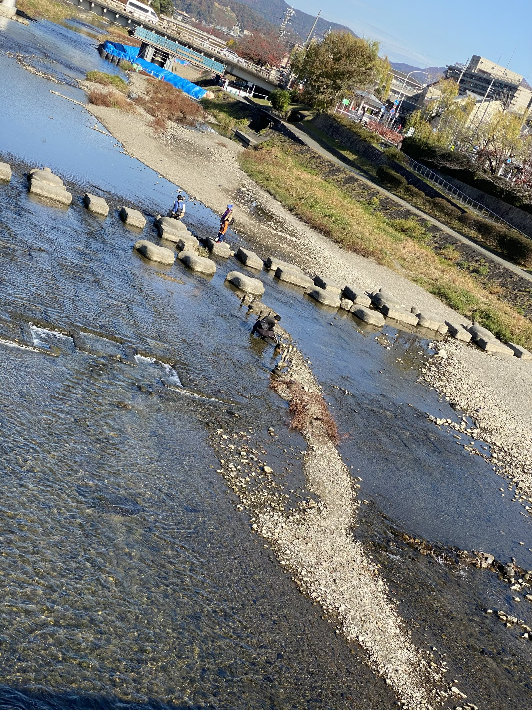

# 日本帰国２０１９年

今年サンクスギビングの間、三年ぶりに日本に帰ってきました！[前回](/4)の投稿ではもうバレてるかもしれませんが、旅行の話をもう少ししようと思って、また投稿します。

## 「帰った」気分

スペイン生まれイギリス育ち二十五歳まで日本に行ってない僕が「日本に*帰った*」というと少しおかしく感じられるかもしれません。確かに日本人でもないし、在留的にもアメリカに住んでいます。

しかし、空港に着いた途端何となくホッとしました。普通に電車を乗ってホテルまで行き、コンビニで普通に暇つぶしをしてから簡単にチェックインしました。その「普通さ」には心が落ちづきますよね。

行く前に日本は懐かしく思っていたが、逆に久しぶりすぎて行ったら嫌になるかもと、どこかで思っていました。実際に行ってみれば、全然そんなことはありませんでした。「日本への旅行」というより、「アメリカの長い旅から一瞬帰ってきた」という気持ちになりました。

## 料理

毎日外食しました！日本はやっぱり料理が美味い！

### 茶禅華

東京広尾駅の近くにある上級中華料理のお店、<ruby>茶禅華<rt>さぜんか</rt></ruby>はすごく人気で予約なかなかできないイメージがあります。私たちは二ヶ月前に予約ができるようになってすぐ海外から電話して、ギリギリ予約取れました！ラッキー！

ワインペアリングもありますが、ティーペアリングというのもあります。結局僕がワイン、妻がお茶にして、シェアしたので全部飲めました！おすすめです。

### つけめん　ＴＥＴＳＵ

昔京都に住んでいたとき京都駅にある「ラーメン小路」の一番好きなお店でした。数年前から京都になくなったが、大阪梅田の三番街にあると分かったら是非行きたいと思っていました。京都から淡路島に行く途中で一旦梅田に寄ってようやく食べに行けました！

つけ麺でよくある話ですが、麺が終わったらスープが残っていて緩くなっている問題があります。そのために、つけ麺があるお店で大体ダシが自由に足せるように置いてあります。足したらスープが温かくなり、薄くなり、飲みやすくなります。

ただ、濃いままで飲みたい人はどうすればいいんですか？そのためのＴＥＴＳＵです！このお店では、お願いしたら最後に熱い鉄の球をスープに入れていただけます。そうすると、スープを温めてから濃いままで飲めます！

久しぶりでやっぱりうまかったんです！

### 十三駅周りのお好み焼き、たこ焼き

観光客として十三で泊まると言ったら答えは大体、「なぜ？」と聞かれました。少し下町の雰囲気であまり見るものがないんですが、アクセスはすごく良かったのです。神戸でも大阪でも京都でも、阪急電鉄ですぐ行けます。

京都に勤めていたときに十三駅で乗り換えしていたので、周りのお店で食べてみたいなぁとよく思いました。今回はチャンスでした！初日は「ねぎ焼き　やまもと」というお店でお好み焼きとネギ焼きを食べました。

次の日のランチが大きかったので、晩にはたこ焼きはちょうどよかった。「大阪イギー」というお店に行きました。

たこ焼きはずっと好きと思っていたが、ご飯には足りないし、ご飯の間に食べたらご飯食べられなくなるし、いつ食べたらいいかという問題があって、結局ほとんど食べる機会がないのですね。今回食べれて嬉しかったのです！

お店は全部カウンター席。店員さんもすごくフレンドリーですし、美味しい焼酎も色々ありました。行けるチャンスがあれば是非おすすめします。

## 京都

今回は東京、京都、大阪、神戸、淡路島と、色んなところに行きましたが、やっぱり僕にとって京都は一番懐かしく、特別なまちです。

着いたときに久々の日本スターバックスのシナモンロールを食べました。これはアメリカのスタバにない商品です！

二日目に大徳寺で茶席に参加しました。お茶会の写真はもちろん撮れませんが、入口にあったこのディスプレイは美しく撮れました。

紅葉も綺麗でした。

次の日は買い物しました。妻はアンティーク着物が好きなので、京都で着物の店を見て回ることを楽しみにしてきました。僕も初めてちゃんとした着物を買えました（今までは浴衣があったが着物は持っていませんでした）。

<ruby>亀屋則克<rt>かめやのりかつ</rt></ruby>という和菓子屋さんで人気商品のわらび餅を注文しました。お店の雰囲気はすごく好きでした。

夜は普通の居酒屋で食べに行きました。生麩が大好きなので、せっかく京都にいるなら食べたかったのです。因みに、妻と初めて祇園祭行ったとき（あのときはまだ彼女だったが…）、ランチはこのお店で食べました。

鴨川を渡っているときにこの人を気づきました。

石を重ねているみたいですね…

すごい！こんな綺麗に立てることなんて、素晴らしい！

アーティストは名刺を置きましたので名前は池西大輔だと分かりました。[ツイッター](https://twitter.com/ismdaisuke)も[インスタ](https://www.instagram.com/daisuke__ism/)もあります。

## 日本語能力試験

今年の目標は日本語能力試験を受けることだったので、最後の日に京大でやりました。今までは日本語のクラスも行っていないし、日本語能力試験も初めてでした。

このキャンパスはＮ１のみだったが、それでもすごい人数でした！千人以上やっていたと思います。結果は二月に発表されるらしいです。

テスト終わって帰っているとき出町柳で鴨川を渡ってこの写真を撮りました。最後の京都の晩。明日は京都駅で「ハルカ」という特急電車を乗り、関空で飛行機を乗ってアメリカに帰ります。

行ってきます！

#旅行 #写真 #日本 #料理 #京都 #日本語能力試験
