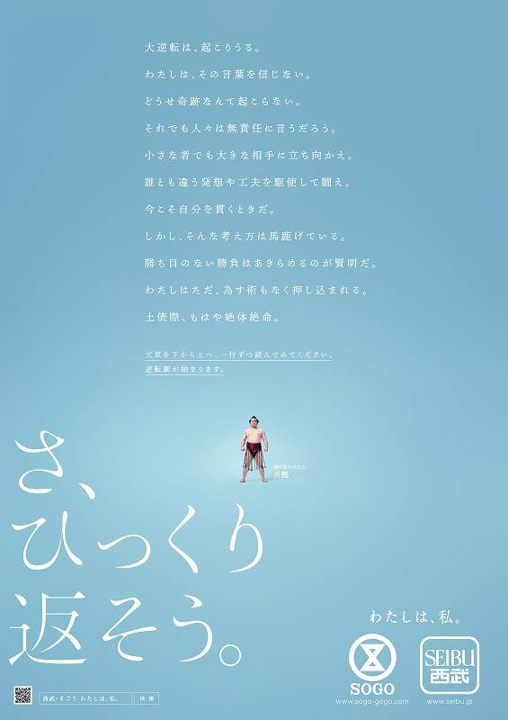

# 逆さまにも読める詩

冬休みの間、株式会社そごう・西武の正月広告「さ、ひっくり変えそう」はかなり話題になりました。普通に読むとマイナスな文章に見えるが、一行ずつ逆さまに読むと逆にポジティブになります。

::: gallery

:::

これを見た時、ある英語の詩を思い出した。２０１６年ブレグジットの国民投票の前に、移民や難民に関するニュースがよく流れていました。移民に対する意見によってブレグジット選んだ人も多かったと思われます。その時、ブライアン・ビルストン氏が書いた「Refugees」という詩が今回の正月広告のようにネットで流行りました。同じように、まず上から読んでから、次逆さまに読むと意味が変わる詩です。

[元の英語版はこちらです。](https://brianbilston.com/2016/03/23/refugees/)初めて読んだときは感動したので、そごう・西武の正月広告をみたらこの詩を思い出して、翻訳してみました。もちろん、僕の日本語は限られているし、元の文章ほど綺麗に通じないと思いますが、自分のできる範囲で同じニュアンスを伝えようとしてみました。

そのまま読んでから、一行ずつ逆さまに読んでみてください。

## 難民

::: verse
彼らに私たちの助けはいらない
だから言わないで欲しい
もし人生が変わるなら
あなたも私もこんな野生な顔になるかもしれない
こう言うけれど　彼らはどう言う人々か
自分勝手な居候
不精の怠け者
きっと爆弾をもっている
殺人者や泥棒
彼らは
歓迎するの
が　無理だから
自国へ帰ること
をやるべきだ
食事を分けること
家を共有すること
国を共有すること
その代わりに
阻むための壁を建てればいい
こう言うのは良くない　→
この人たちと私たちは一緒だ
国は生まれた人の物である
こんな馬鹿なことを思わないで　→
世界は異なる見方ができる
:::

#詩 #翻訳
