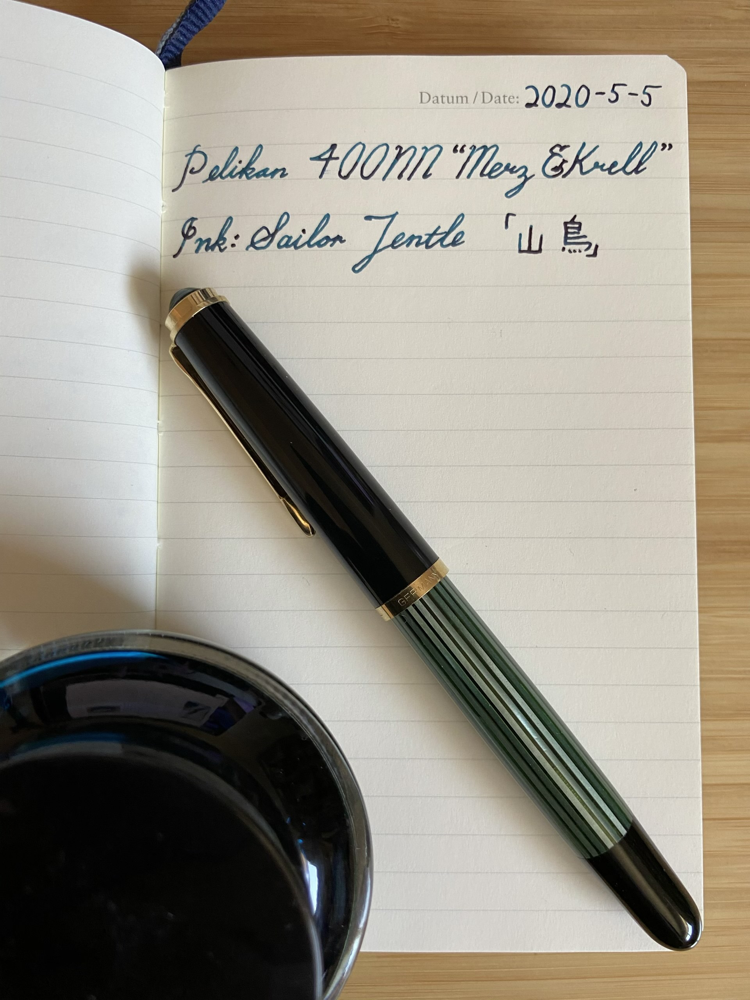
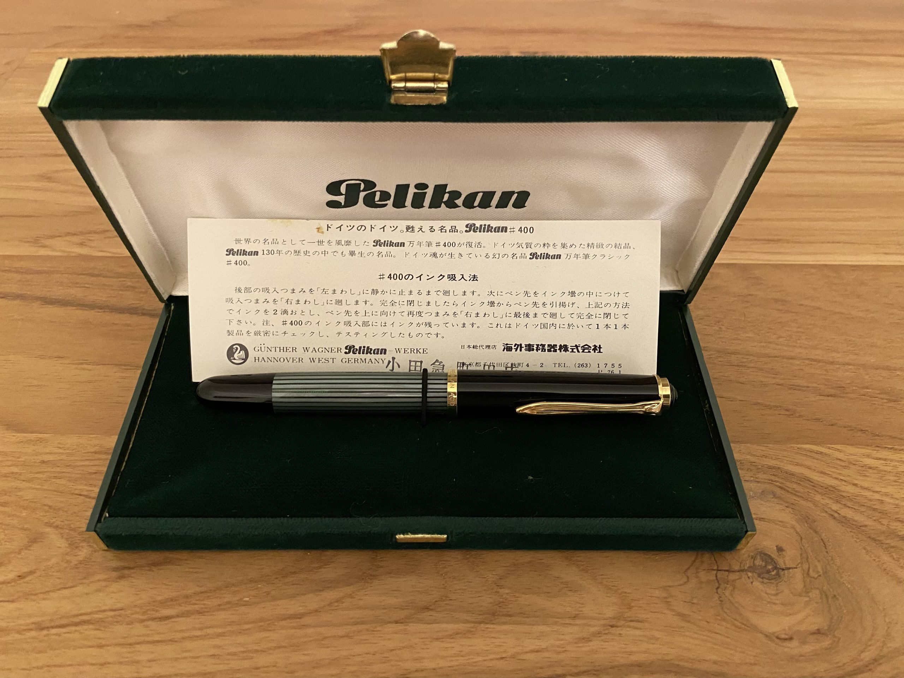
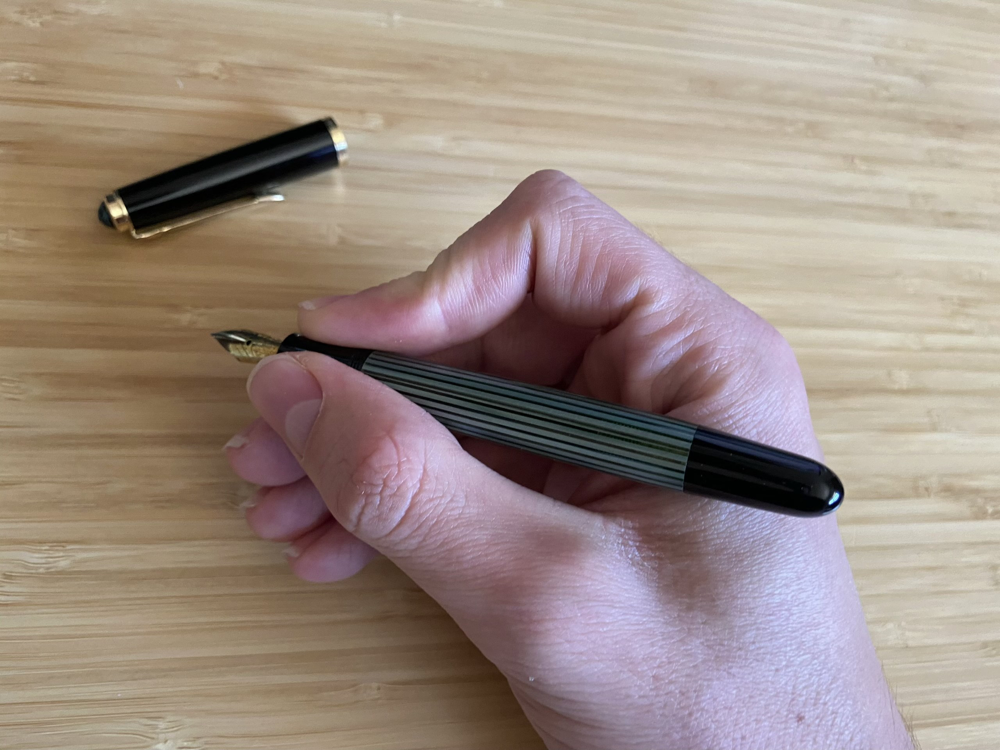
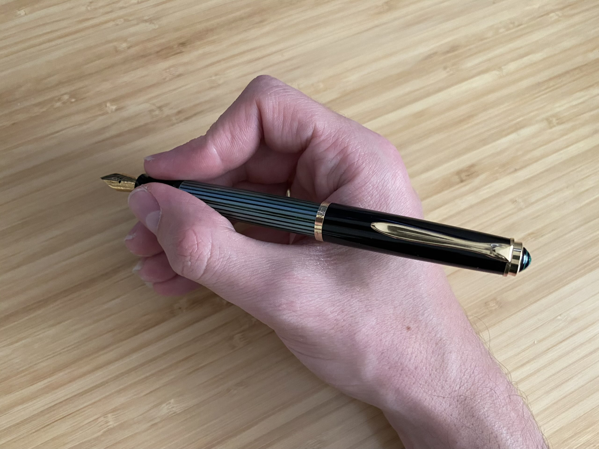

## 自宅退避中購入　その一
# 万年筆　ペリカン４００「Ｍ＆Ｋ」

これは実は自宅退避が始まるちょっと前に購入したものですが、まだアップしてなかったので一応「自宅退避中」ということにしましょう。

はじめてのペリカン、そしてはじめてのヴィンテージペンです！

ペリカンのデザインがずっと好きだったし、何回かお店で試しにいったことがありますが、ＥＦでもペン先太いなぁと、いつも思ってしまいなかなか買う気になれませんでした。

そこで「ヴィンテージ」！昔のペリカンはもう少し細いペン先使っていたらしい。[調べたら](https://thepelikansperch.com/2019/03/05/pelikan-400-fountain-pen/)欲しいと思っていたモデルが１９６５年までだったが、日本の小売業者の依頼に応じて、１９７３年〜１９７８年の間ペリカン社が「メルツ＆クレル」という会社に頼んで*日本のみ*の４００ＮＮ作りました。

しかも[eBay](https://ebay.com)で探してみればちょうどそのときに使われたことのないデッドストックがありました。「買う！」と、思わず思って、結果これが届きました。
 

デザインは流石ペリカンですね。バレルの緑は綺麗。他に色がありますが、やっぽり緑が一番クラシック感があり、一番美しいと個人的に思います。

キャップを外すとこんな感じになります。少し短めかも知れませんが（特に人気なスーベランＭ６００と比べるとね）、とても持ちやすい形をしていると思います。私個人としてはいつもこういう持ち方しています。

短いのが嫌！と思う方は後ろにつけることもできます。こう持ってもバランスはかなり良いので、どちらでもできる、よりフレキシブルなデザインになっています。

「で、ペン先は？太い？細い？」

最初の写真を観るとペン先はまぁ、行けるレベルかな？確かにこれがＥＦかと言われたらそこまでは言わないだろうが、モダンなペリカンよりはマシだと思います。実際に使ってみると、やっぱり持っているＴＷＳＢＩやパイロットよりは太いが、「太すぎる」という感じはしません。代わりに、書き心地はいい！とても使いやすい万年筆です。

#自宅退避 #購入 #自宅退避中購入 #万年筆
